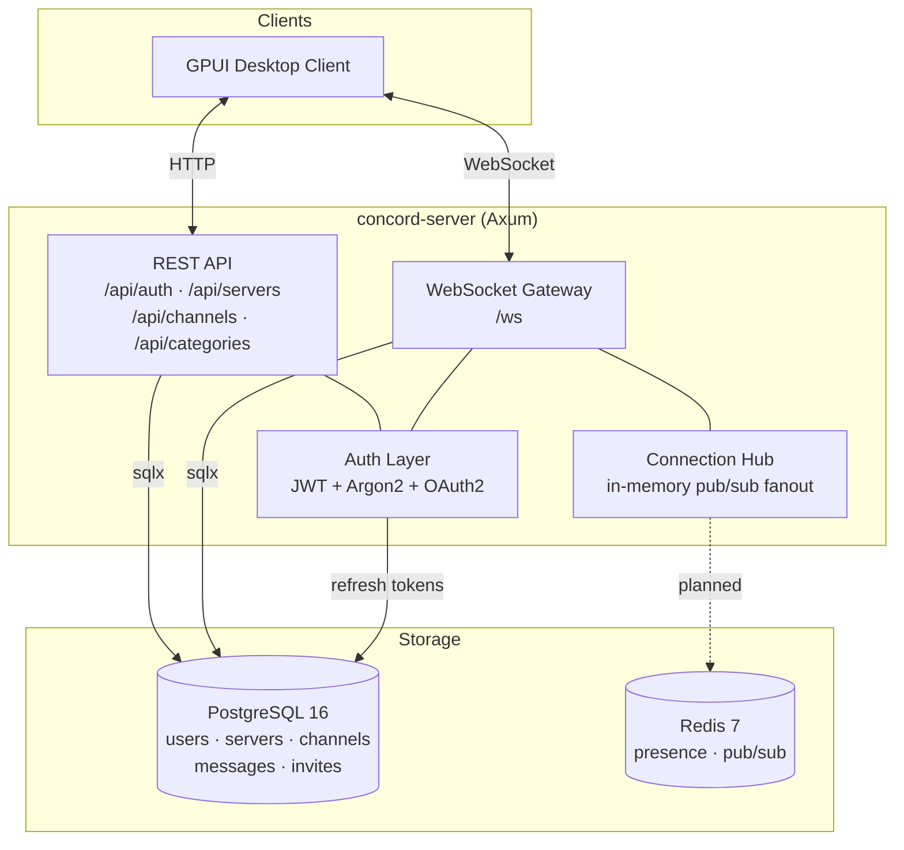

# Concord

A Discord-like chat application built entirely in Rust. Real-time messaging
over WebSocket, REST API for resource management, JWT + OAuth authentication,
backed by Postgres and Redis. Desktop client planned with [GPUI](https://gpui.rs/).



## Features

- **Real-time messaging** -- WebSocket gateway with typed JSON protocol
  (`ClientMsg` / `ServerMsg`) for sending, editing, deleting messages, typing
  indicators, and presence updates
- **Servers & channels** -- create servers, invite members via short codes,
  organize channels into categories, manage roles (owner / admin / member)
- **Authentication** -- password login (Argon2 hashing), JWT access + refresh
  token rotation, OAuth2 flows for GitHub and Google
- **Input validation** -- server-side checks on usernames, emails, passwords,
  channel names, message content, icon URLs, and invite codes
- **Typed protocol** -- `concord-shared` crate defines all wire types so
  client and server stay in sync

## Workspace layout

```
concord/
├── crates/
│   ├── concord-server   # Axum backend: HTTP routes, WebSocket, DB queries
│   ├── concord-shared   # Protocol types, domain types, validation
│   └── concord-client   # GPUI desktop client (planned)
├── migrations/          # Postgres schema (sqlx-cli)
├── docs/                # Architecture docs, ER diagram
└── docker-compose.yml   # Postgres 16 + Redis 7
```

## API surface

### REST

| Method   | Path                                         | Description             |
| -------- | -------------------------------------------- | ----------------------- |
| `POST`   | `/api/auth/register`                         | Create account          |
| `POST`   | `/api/auth/login`                            | Password login          |
| `POST`   | `/api/auth/refresh`                          | Rotate refresh token    |
| `GET`    | `/api/auth/oauth/github`                     | GitHub OAuth redirect   |
| `GET`    | `/api/auth/oauth/google`                     | Google OAuth redirect   |
| `POST`   | `/api/servers`                               | Create server           |
| `GET`    | `/api/servers`                               | List joined servers     |
| `GET`    | `/api/servers/:id`                           | Get server details      |
| `PATCH`  | `/api/servers/:id`                           | Update server           |
| `DELETE` | `/api/servers/:id`                           | Delete server (owner)   |
| `POST`   | `/api/servers/:id/invites`                   | Create invite code      |
| `POST`   | `/api/servers/:id/join`                      | Join via invite         |
| `DELETE` | `/api/servers/:id/members/me`                | Leave server            |
| `GET`    | `/api/servers/:id/members`                   | List members            |
| `POST`   | `/api/servers/:id/channels`                  | Create channel          |
| `GET`    | `/api/servers/:id/channels`                  | List channels           |
| `POST`   | `/api/servers/:id/categories`                | Create category         |
| `GET`    | `/api/servers/:id/categories`                | List categories         |
| `PATCH`  | `/api/channels/:id`                          | Update channel          |
| `DELETE` | `/api/channels/:id`                          | Delete channel          |
| `POST`   | `/api/dms`                                   | Create group DM         |
| `POST`   | `/api/dms/:id/members`                       | Add member to group DM  |
| `DELETE` | `/api/dms/:id/members/:user_id`              | Remove member / leave   |

### WebSocket (`/ws`)

Clients connect, authenticate with a JWT, then exchange JSON-tagged messages:

**Client -> Server:** `authenticate`, `send_message`, `edit_message`,
`delete_message`, `join_channel`, `leave_channel`, `start_typing`,
`create_server`, `join_server`, `leave_server`, `update_status`

**Server -> Client:** `authenticated`, `new_message`, `message_edited`,
`message_deleted`, `user_typing`, `presence_update`, `member_joined`,
`member_left`, `server_created`, `error`

## Getting started

### Prerequisites

- Rust toolchain (stable)
- Docker & Docker Compose
- [`sqlx-cli`](https://crates.io/crates/sqlx-cli)

### 1. Clone and configure

```sh
git clone https://github.com/Dnreikronos/concord.git
cd concord
cp .env.example .env
```

Edit `.env` and set real values for at least these:

| Variable              | Purpose                           | How to generate                  |
| --------------------- | --------------------------------- | -------------------------------- |
| `POSTGRES_PASSWORD`   | Postgres superuser password       | Any strong password              |
| `REDIS_PASSWORD`      | Redis auth password               | Any strong password              |
| `JWT_SECRET`          | Signs access & refresh tokens     | `openssl rand -hex 32`           |

For OAuth login (optional):

| Variable                       | Purpose                      |
| ------------------------------ | ---------------------------- |
| `GITHUB_OAUTH_CLIENT_ID`      | GitHub OAuth app client ID   |
| `GITHUB_OAUTH_CLIENT_SECRET`  | GitHub OAuth app secret      |
| `GOOGLE_OAUTH_CLIENT_ID`      | Google OAuth client ID       |
| `GOOGLE_OAUTH_CLIENT_SECRET`  | Google OAuth client secret   |

### 2. Start infrastructure

```sh
docker compose up -d
```

This starts PostgreSQL 16 and Redis 7 on loopback (`127.0.0.1`), ports from `.env`.

### 3. Set up the database

```sh
cargo install sqlx-cli --no-default-features --features rustls,postgres
```

> **Note:** if your password contains `@`, `:`, `/`, `?`, `#`, or other
> reserved URL characters, percent-encode them in the connection string
> (e.g. `@` -> `%40`).

```sh
export DATABASE_URL="postgres://concord:<POSTGRES_PASSWORD>@localhost:5432/concord"

sqlx database create        # first time only
sqlx migrate run            # apply all pending migrations
```

### 4. Run the server

```sh
cargo run -p concord-server
```

The server listens on `0.0.0.0:8080` by default -- REST API and WebSocket on the same port.

### Reset database (development)

```sh
sqlx database drop -y && sqlx database create && sqlx migrate run
```

## Tech stack

| Layer          | Technology                              |
| -------------- | --------------------------------------- |
| Language       | Rust (2021 edition)                     |
| HTTP + WS      | Axum 0.8                                |
| Async runtime  | Tokio (multi-threaded)                  |
| Database       | PostgreSQL 16 via sqlx 0.8              |
| Cache / pubsub | Redis 7                                 |
| Auth           | Argon2, JWT (jsonwebtoken), OAuth2      |
| Serialization  | serde + serde_json                      |
| Concurrency    | DashMap, tokio::sync                    |
| Desktop client | GPUI (planned)                          |

## Documentation

See [`docs/ARCHITECTURE.md`](docs/ARCHITECTURE.md) for the full architecture
description, database schema, ER diagram, and cascade-delete policy.

## License

MIT
