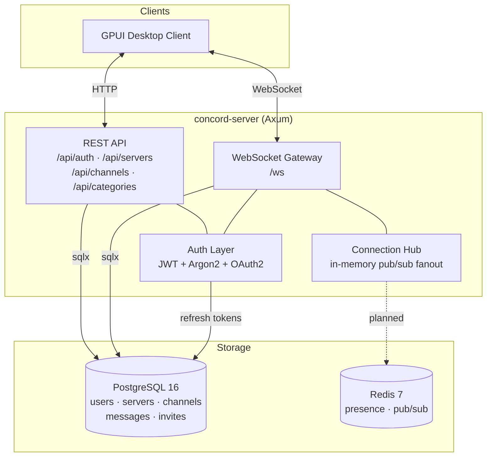

# Concord

A Discord-like chat application built entirely in Rust. Real-time messaging
over WebSocket, REST API for resource management, JWT + OAuth authentication,
backed by Postgres and Redis, with a native desktop client built on
[GPUI](https://gpui.rs/).


```mermaid
graph TB
    subgraph Clients
        GPUI[GPUI Desktop Client]
    end

    subgraph Backend ["concord-server (Axum)"]
        direction TB
        REST[REST API<br/>/api/auth · /api/servers<br/>/api/channels · /api/categories]
        WS[WebSocket Gateway<br/>/ws]
        HUB[Connection Hub<br/>in-memory pub/sub fanout]
        AUTH[Auth Layer<br/>JWT + Argon2 + OAuth2]
    end

    subgraph Storage
        PG[(PostgreSQL 16<br/>users · servers · channels<br/>messages · invites)]
        RD[(Redis 7<br/>presence · pub/sub)]
    end

    GPUI <-->|HTTP| REST
    GPUI <-->|WebSocket| WS
    WS --- HUB
    REST --- AUTH
    WS --- AUTH
    REST -->|sqlx| PG
    WS -->|sqlx| PG
    HUB -.->|planned| RD
    AUTH -->|refresh tokens| PG
```

## Features

- **Real-time messaging** -- WebSocket gateway with typed JSON protocol
  (`ClientMsg` / `ServerMsg`) for sending, editing, deleting messages, typing
  indicators, and presence updates
- **Servers & channels** -- create servers, invite members via short codes,
  organize channels into categories, manage roles (owner / admin / member)
- **Authentication** -- password login (Argon2 hashing), JWT access + refresh
  token rotation, OAuth2 flows for GitHub and Google
- **Input validation** -- server-side checks on usernames, emails, passwords,
  channel names, message content, icon URLs, and invite codes
- **Typed protocol** -- `concord-shared` crate defines all wire types so
  client and server stay in sync
- **Desktop client** -- native GPUI app: password / OAuth login, server and
  channel navigation, direct and group messages, a live composer with typing
  indicators, and native desktop notifications for background messages

## Workspace layout

```
concord/
├── crates/
│   ├── concord-server   # Axum backend: HTTP routes, WebSocket, DB queries
│   ├── concord-shared   # Protocol types, domain types, validation
│   └── concord-client   # GPUI desktop client: login, chat, notifications
├── migrations/          # Postgres schema (sqlx-cli)
├── docs/                # Architecture docs, ER diagram
└── docker-compose.yml   # Postgres 16 + Redis 7 + the server
```

## API surface

### REST

| Method   | Path                                         | Description             |
| -------- | -------------------------------------------- | ----------------------- |
| `POST`   | `/api/auth/register`                         | Create account          |
| `POST`   | `/api/auth/login`                            | Password login          |
| `POST`   | `/api/auth/refresh`                          | Rotate refresh token    |
| `GET`    | `/api/auth/oauth/github`                     | GitHub OAuth redirect   |
| `GET`    | `/api/auth/oauth/google`                     | Google OAuth redirect   |
| `GET`    | `/api/users/search?q=`                       | Search users by name    |
| `POST`   | `/api/servers`                               | Create server           |
| `GET`    | `/api/servers`                               | List joined servers     |
| `GET`    | `/api/servers/:id`                           | Get server details      |
| `PATCH`  | `/api/servers/:id`                           | Update server           |
| `DELETE` | `/api/servers/:id`                           | Delete server (owner)   |
| `POST`   | `/api/servers/:id/invites`                   | Create invite code      |
| `POST`   | `/api/servers/:id/join`                      | Join via invite         |
| `DELETE` | `/api/servers/:id/members/me`                | Leave server            |
| `GET`    | `/api/servers/:id/members`                   | List members            |
| `POST`   | `/api/servers/:id/channels`                  | Create channel          |
| `GET`    | `/api/servers/:id/channels`                  | List channels           |
| `POST`   | `/api/servers/:id/categories`                | Create category         |
| `GET`    | `/api/servers/:id/categories`                | List categories         |
| `PATCH`  | `/api/channels/:id`                          | Update channel          |
| `DELETE` | `/api/channels/:id`                          | Delete channel          |
| `GET`    | `/api/channels/:id/messages`                 | Message history         |
| `POST`   | `/api/dms`                                   | Open or reuse 1:1 DM    |
| `POST`   | `/api/dms/group`                             | Create group DM         |
| `POST`   | `/api/dms/:id/members`                       | Add member to group DM  |
| `DELETE` | `/api/dms/:id/members/:user_id`              | Remove member / leave   |
| `GET`    | `/health`                                    | Liveness probe          |

### WebSocket (`/ws`)

Clients connect, authenticate with a JWT, then exchange JSON-tagged messages:

**Client -> Server:** `authenticate`, `send_message`, `edit_message`,
`delete_message`, `join_channel`, `leave_channel`, `start_typing`,
`create_server`, `join_server`, `leave_server`, `update_status`

**Server -> Client:** `authenticated`, `new_message`, `message_edited`,
`message_deleted`, `user_typing`, `presence_update`, `member_joined`,
`member_left`, `server_created`, `error`

## Getting started

### Prerequisites

- Rust toolchain (stable)
- Docker & Docker Compose
- [`sqlx-cli`](https://crates.io/crates/sqlx-cli)
- For the desktop client: a C/C++ toolchain and, on Linux, X11 + Wayland and
  font (`fontconfig` / `freetype`) development packages — GPUI compiles its
  native windowing and text stack from source

### 1. Clone and configure

```sh
git clone https://github.com/Dnreikronos/concord.git
cd concord
cp .env.example .env
```

Edit `.env` and set real values for at least these:

| Variable              | Purpose                           | How to generate                  |
| --------------------- | --------------------------------- | -------------------------------- |
| `POSTGRES_PASSWORD`   | Postgres superuser password       | Any strong password              |
| `REDIS_PASSWORD`      | Redis auth password               | Any strong password              |
| `JWT_SECRET`          | Signs access & refresh tokens     | `openssl rand -hex 32`           |

For OAuth login (optional):

| Variable                       | Purpose                      |
| ------------------------------ | ---------------------------- |
| `GITHUB_OAUTH_CLIENT_ID`      | GitHub OAuth app client ID   |
| `GITHUB_OAUTH_CLIENT_SECRET`  | GitHub OAuth app secret      |
| `GOOGLE_OAUTH_CLIENT_ID`      | Google OAuth client ID       |
| `GOOGLE_OAUTH_CLIENT_SECRET`  | Google OAuth client secret   |

### 2. Start the stack

```sh
docker compose up -d --build
```

This builds the `concord-server` image and starts PostgreSQL 16, Redis 7, and the
server on loopback (`127.0.0.1`), ports from `.env`. The server waits for Postgres
and Redis to report healthy, applies any pending database migrations on startup,
then serves the REST API and WebSocket on port 8080.

Tail the logs with `docker compose logs -f server`; stop everything with
`docker compose down` (add `-v` to also drop the data volumes).

### Running the server from source (optional)

For server development you can run the binary directly against the compose
Postgres and Redis instead of rebuilding the image. Migrations still run
automatically when the server starts; `sqlx-cli` is only needed for managing the
database by hand (creating or resetting it).

```sh
cargo install sqlx-cli --no-default-features --features rustls,postgres
```

> **Note:** if your password contains `@`, `:`, `/`, `?`, `#`, or other
> reserved URL characters, percent-encode them in the connection string
> (e.g. `@` -> `%40`).

```sh
export DATABASE_URL="postgres://concord:<POSTGRES_PASSWORD>@localhost:5432/concord"
export JWT_SECRET="<at least 32 bytes>"

# Start only the dependencies, then run the server from source.
docker compose up -d postgres redis
cargo run -p concord-server
```

The server listens on `0.0.0.0:8080` by default -- REST API and WebSocket on the same port.

A multi-stage `Dockerfile` builds the server into a minimal Alpine image as an
alternative to `cargo run`:

```sh
docker build -t concord-server .
```

The image expects the same `DATABASE_URL` and `JWT_SECRET` in its environment,
exposes port `8080`, and ships a built-in `/health` check.

### 5. Run the desktop client

The GPUI client lives behind the `gui` cargo feature, so the default build (the
WebSocket library and its tests) stays light. With the server running:

```sh
cargo run -p concord-client --bin concord-ui --features gui
```

> The first build clones and compiles the GPUI stack from git and can take
> several minutes; later builds are incremental.

By default the client talks to `http://127.0.0.1:8080`, matching the server's
default bind. Point it elsewhere with `CONCORD_API_URL` (and optionally
`CONCORD_WS_URL`, which is otherwise derived from the API URL):

```sh
CONCORD_API_URL=https://chat.example.com \
  cargo run -p concord-client --bin concord-ui --features gui
```

### Reset database (development)

```sh
sqlx database drop -y && sqlx database create && sqlx migrate run
```

## Configuration

All configuration is via environment variables. The server reads them straight
from its process environment (it does **not** auto-load `.env`), so export them
-- or use a tool like `direnv` -- before launching.

### Server

| Variable                     | Required | Default   | Description                                                  |
| ---------------------------- | -------- | --------- | ------------------------------------------------------------ |
| `DATABASE_URL`               | yes      | --        | Postgres connection string                                   |
| `JWT_SECRET`                 | yes      | --        | Signs access & refresh tokens; must be at least 32 bytes     |
| `HOST`                       | no       | `0.0.0.0` | Bind address                                                 |
| `PORT`                       | no       | `8080`    | Bind port (REST and WebSocket share it)                      |
| `MAX_CONNECTIONS`            | no       | `10`      | Postgres connection-pool size                                |
| `REDIS_URL`                  | no       | --        | Presence store + cross-instance typing; unset disables both  |
| `PRESENCE_TTL_SECONDS`       | no       | `60`      | Presence lifetime without a heartbeat (minimum `2`)          |
| `GITHUB_OAUTH_CLIENT_ID`     | no       | --        | Enables GitHub login when set (secret + redirect then required) |
| `GITHUB_OAUTH_CLIENT_SECRET` | no       | --        | GitHub OAuth app secret                                      |
| `GITHUB_OAUTH_REDIRECT_URL`  | no       | --        | GitHub OAuth callback URL                                    |
| `GOOGLE_OAUTH_CLIENT_ID`     | no       | --        | Enables Google login when set (secret + redirect then required) |
| `GOOGLE_OAUTH_CLIENT_SECRET` | no       | --        | Google OAuth client secret                                   |
| `GOOGLE_OAUTH_REDIRECT_URL`  | no       | --        | Google OAuth callback URL                                    |

### Desktop client

| Variable          | Default                 | Description                                                              |
| ----------------- | ----------------------- | ----------------------------------------------------------------------- |
| `CONCORD_API_URL` | `http://127.0.0.1:8080` | Base URL of the REST API                                                |
| `CONCORD_WS_URL`  | derived from API URL    | WebSocket URL; defaults to the API URL with the scheme swapped to `ws(s)` and `/ws` appended |

### Docker Compose

`docker-compose.yml` reads these (from `.env`) to provision Postgres and Redis:

| Variable            | Default   | Description                   |
| ------------------- | --------- | ---------------------------- |
| `POSTGRES_DB`       | `concord` | Database name                |
| `POSTGRES_USER`     | `concord` | Database user                |
| `POSTGRES_PASSWORD` | --        | Database password (required) |
| `POSTGRES_PORT`     | `5432`    | Host port mapped to Postgres |
| `REDIS_PASSWORD`    | --        | Redis password (required)    |
| `REDIS_PORT`        | `6379`    | Host port mapped to Redis    |

## Tech stack

| Layer          | Technology                              |
| -------------- | --------------------------------------- |
| Language       | Rust (2021 edition)                     |
| HTTP + WS      | Axum 0.8                                |
| Async runtime  | Tokio (multi-threaded)                  |
| Database       | PostgreSQL 16 via sqlx 0.8              |
| Cache / pubsub | Redis 7                                 |
| Auth           | Argon2, JWT (jsonwebtoken), OAuth2      |
| Serialization  | serde + serde_json                      |
| Concurrency    | DashMap, tokio::sync                    |
| Desktop client | GPUI                                    |
| Notifications  | notify-rust · mac-notification-sys · WinRT |

## Documentation

See [`docs/ARCHITECTURE.md`](docs/ARCHITECTURE.md) for the full architecture
description, database schema, ER diagram, and cascade-delete policy.

## Contributing

Contributions are welcome. A few conventions this repo follows:

- **One issue per branch.** Work is split into small feature branches; a PR
  targets the branch it was based on rather than `main` directly, so related
  work stays stacked and reviewable.
- **clippy is the gate, not rustfmt.** Run `cargo clippy --all-targets` and keep
  it clean. The tree is not `cargo fmt`-formatted -- match the style of the
  surrounding code by hand rather than reformatting whole files.
- **Keep the default build fast.** The desktop client's GPUI dependencies are
  optional and gated behind the `gui` feature, so plain `cargo build` /
  `cargo test` stay light. Run the GUI checks explicitly with `--features gui`
  when you touch client UI code.
- **Run the tests.** `cargo test` covers the libraries and unit tests; the
  server's integration tests need a Postgres instance (`DATABASE_URL` pointed at
  a throwaway database -- `docker compose up -d postgres` is enough).
- **Shared types live in `concord-shared`.** Wire and domain types belong there
  so the client and server can't drift out of sync.
- **Commit messages** are short imperative subjects (`Add ...`, `Fix ...`) with
  no conventional-commit prefixes.

## License

MIT
