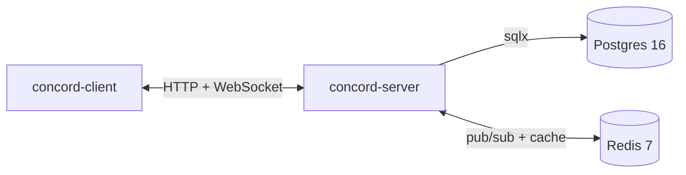
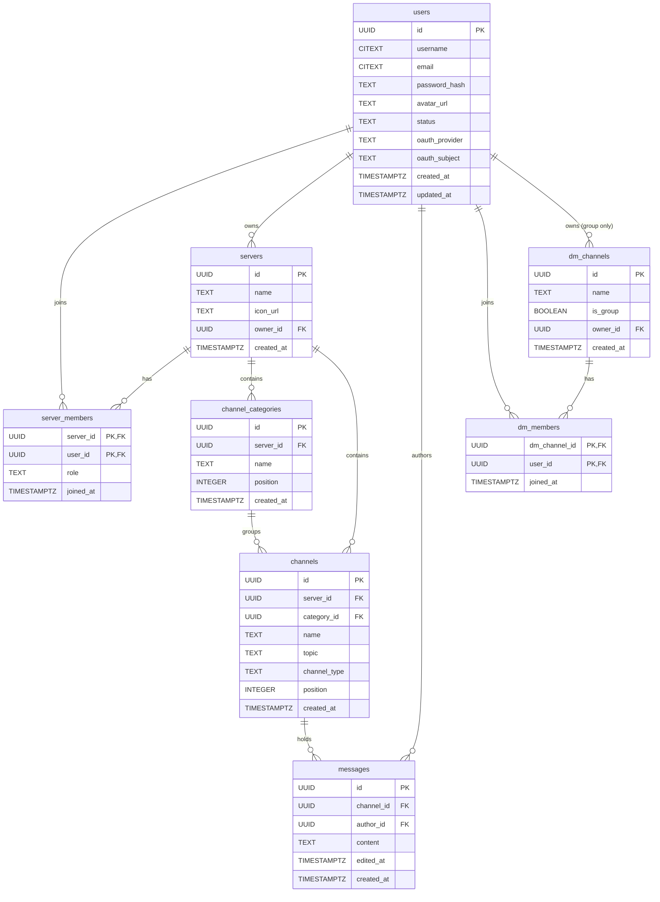

# Concord Architecture

A snapshot of where the project stands today and the shape it is growing into.
This document is the canonical pointer for "how do the pieces fit together?" —
prefer linking here over re-explaining in PRs.

> **Status:** very early. Most of the runtime is stubs; the storage schema is
> the first piece of real infrastructure. Sections below are honest about
> what is implemented vs. planned.

---

## 1. Overview

Concord is a Discord-like chat application implemented as a Rust workspace.
The intended deployment is a single backend service speaking to a Postgres
database for durable state and a Redis instance for ephemeral state and
pub/sub fanout, with a desktop / web client connecting over WebSocket plus
HTTP.

## 2. Workspace layout

| Crate            | Role                                                     | State        |
| ---------------- | -------------------------------------------------------- | ------------ |
| `concord-shared` | Types and protocol definitions shared by client + server | Stub         |
| `concord-server` | Backend service: HTTP, WebSocket, persistence            | `println!`   |
| `concord-client` | Desktop / web client (TBD framework)                     | Stub         |

The `migrations/` directory at the repo root holds the Postgres schema; it
lives outside any crate because it is infrastructure, not server-private code,
and may eventually be consumed by tests or tooling that don't depend on the
server binary.

## 3. Runtime topology

Postgres holds the durable record (users, servers, channels, messages).
Redis is reserved for things that don't need to survive a restart: session
caches, presence, and the pub/sub bus that fans WebSocket events out across
server instances.

## 4. Data layer

### Migrations

Schema changes are managed with [`sqlx-cli`](https://crates.io/crates/sqlx-cli)
and live in `/migrations` at the repo root. Files use a fixed numeric prefix
(`NNNN_name.sql`) so ordering is deterministic and not tied to wall-clock
timestamps. Migrations are forward-only — there are no `_down.sql` files.
While the schema is still pre-production, rollback means
`sqlx database drop && sqlx database create && sqlx migrate run`.

Current migrations:

| File                          | Purpose                                         |
| ----------------------------- | ----------------------------------------------- |
| `0000_extensions.sql`         | Enable `pgcrypto` (`gen_random_uuid()`) and `citext` (case-insensitive identifiers) |
| `0001_initial_schema.sql`     | Tables, indexes, and CHECK constraints          |
| `0002_review_feedback.sql`    | Non-empty `password_hash` guard and indexes on nullable `ON DELETE SET NULL` FKs |

### Conventions

* Primary keys are `UUID DEFAULT gen_random_uuid()` everywhere.
* Timestamps are `TIMESTAMPTZ NOT NULL DEFAULT now()`.
* Enum-like columns are `TEXT` + a `CHECK` constraint (not Postgres `ENUM`),
  to keep `ALTER` cheap and to interop cleanly with `sqlx::query!`.

### ON DELETE policy

The policy is mixed on purpose. The guiding rule is *preserve social and
historical context where it's cheap to do so, and cascade only when the
dependent rows have no meaning without their parent*.

| Trigger             | Effect                                                                                                             |
| ------------------- | ------------------------------------------------------------------------------------------------------------------ |
| User delete         | `RESTRICT` on `servers.owner_id`; `SET NULL` on `messages.author_id` and `dm_channels.owner_id`; `CASCADE` on `server_members` / `dm_members` |
| Server delete       | `CASCADE` → members, categories, channels (and transitively their messages)                                        |
| Channel delete      | `CASCADE` → messages                                                                                               |
| Category delete     | `SET NULL` on `channels.category_id` (channels survive, just become uncategorised)                                 |
| DM channel delete   | `CASCADE` → `dm_members`                                                                                           |

`RESTRICT` on `servers.owner_id` means a server owner can't be deleted
without first transferring the server or deleting it — the alternative
(cascading the delete and nuking the whole community) is almost never what
the caller intended.

### ER diagram

## 5. Authentication (planned)

Two paths, unified at the `users` table:

* **Password.** Argon2-hashed; stored in `users.password_hash`.
* **OAuth.** Google and GitHub. The provider name lives in
  `users.oauth_provider` and the provider's stable subject ID in
  `users.oauth_subject`; a partial unique index guarantees a given
  `(provider, subject)` maps to exactly one local user.

A `CHECK` constraint enforces that every user has at least one auth path
(either a password hash or an OAuth link). Sessions will be JWTs signed with
`JWT_SECRET`, but the wiring lands in a later issue.

## 6. Realtime (planned)

Clients hold a persistent WebSocket to `concord-server`. Server-side, message
events publish to a Redis channel so that multiple `concord-server` instances
can fan out to all connected clients regardless of which instance owns the
socket. None of this is implemented yet.

## 7. Deployment

`docker-compose.yml` provisions Postgres 16 and Redis 7 bound to loopback
(`127.0.0.1`) on a dedicated network. Both ports and credentials come from
`.env`; see `.env.example` for the full set. The server itself currently runs
on the host (`cargo run -p concord-server`); containerising it lands later.

## 8. Status

| Area              | State                                                              |
| ----------------- | ------------------------------------------------------------------ |
| Workspace skeleton| Done                                                               |
| Docker Compose    | Postgres + Redis up, isolated network, loopback-only ports         |
| Migrations        | Initial schema (this doc)                                          |
| sqlx runtime      | Not yet — added with the connection pool in a follow-up issue      |
| HTTP server       | Stub (`println!`)                                                  |
| Auth              | Schema present; logic pending                                      |
| WebSocket / Redis | Pending                                                            |
| Client            | Stub                                                               |

## 9. Open questions

* **DM messages.** `messages.channel_id` references `channels(id)`, but DM
  conversations live in the separate `dm_channels` table — so there is
  currently no place for a DM message to land. Two candidates to resolve when
  the messaging path is wired up:
  * (a) merge `channels` and `dm_channels` into a single polymorphic table
    with a `kind` discriminator, or
  * (b) introduce a parallel `dm_messages` table with the same shape as
    `messages`.

  Option (a) keeps queries uniform; option (b) keeps server-channel queries
  (the hot path) free of DM-only branching. Picking one is out of scope for
  the initial schema.

* **`updated_at` triggers.** Right now `users.updated_at` defaults to `now()`
  but is not auto-bumped on `UPDATE`. A generic trigger function will be
  worth adding when there are more update-heavy tables to justify it.
